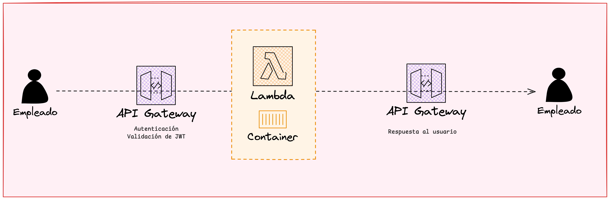

## Introducción

En este repositorio presento la **arquitectura RAG** que diseñé para el tercer challenge de Ueno Bank, usando servicios de AWS y un motor de orquestación basado en LangGraph. Mi objetivo es mostrar:

1. Cómo creo y mantengo la Knowledge Base.  
2. El flujo de ingesta y actualización de documentos.  
3. El esquema general de la aquitectura RAG.
4. Un *deep-dive* de la etapa de retrieval.  
5. La capa de exposición de la aplicación vía API.  
6. El flujo en vivo desde la petición del empleado hasta la respuesta final.

---

## Etapa 1: Knowledge Base Creation

- Conecto a S3/RDS como datasource.
- Elijo **Titan Text Embeddings v2** (1024‑dim, soporte multilingüe, optimizado para RAG, buena precisión y más barato que la v1).
- Configuro chunking y OpenSearch Serverless como backend vectorial.

---

## Etapa 2: Ingesta y Actualización

**Propósito**: mantener la KB sincronizada sin intervención manual.

- **Amazon S3 / RDS**: Almacenan PDFs y tablas estructuradas que disparan eventos.
- **Amazon SQS**: Recibe los eventos de S3; actúa como búfer, permite *batch N* mensajes por lote y ofrece reintentos automáticos.
- **DLQ (Dead-Letter Queue)**: Cola asociada a SQS donde terminan los mensajes que Lambda no pudo procesar después de los reintentos; facilita auditoría y reprocesos.
- **AWS Lambda (Container Image)**: Se activa por lotes desde SQS, extrae el contenido, llama a **Amazon Bedrock** para generar embeddings y envía los vectores.
- **OpenSearch Service (VectorStore)**: Indexa los embeddings y metadatos para consultas semánticas posteriores.

---

## Etapa 3: Arquitectura RAG

**Propósito**: procesar la pregunta del usuario con posibilidad de omitier retrieval si no es necesario, o enriquecerla con contexto.

- **Router LLM (Claude 3 Haiku)**: decide si la consulta requiere retrieval o se atiende con LLM ligero. Elegí Claude 3.5 Haiku porque es rápido, barato y suficiente para tareas de clasificación simples.
- **Query Re‑Writer (Claude 3 Haiku)**: limpia y normaliza la pregunta para mejorar la recuperación; nuevamente seleccioné Claude 3.5 Haiku debido al objetivo de este nodo. Necesito:
    - (1) comprensión semántica suficiente para detectar intención y extraer el core de la query del usuario
    - (2) baja latencia para no penalizar el tiempo total de respuesta
    - (3) coste muy bajo porque el router lo va a invocar en la mayoría de las interacciones.
- **Retriever + Re‑Ranker**: Bedrock KB + OpenSearch traen top‑25 <i>(traigo documentos por demás para ejecutar después un re-ranker y seleccionar menos)</i> y el re‑ranker de Bedrock selecciona top‑5. Es decir utilizo Bedrock para Retrieve y Rerank.
- **LLM Final (Claude 3 Sonnet)**: genera respuesta final combinando el contexto recuperado; elegí Sonnet por su buen equilibrio entre razonamiento (≈87 % MMLU - [Fuente Anthropic](https://www.anthropic.com/news/claude-4)) y coste moderado.
- **Light LLM**: si no fuera necesario tener que pasar por la etapa de retrieve, elijo nuevamnete un modelo ligero que responde directamente consultas sencillas.

Esta arquitectura va a estar orquestada mediante LangGraph. Una representación de la misma podría ser la siguiente:

---

## Etapa 4: Deep‑Dive en el retrieve 

**Propósito**: ilustrar cómo funciona internamente la etapa del retrieve

1. Recordar que el input de este nodo es el prompt optimizado.
2. Se calcula embedding con **Titan Text Embeddings v2**
3. Se ejecuta búsqueda KNN sobre **OpenSearch Serverless**, obteniendo top‑25.
4. Se aplica re-ranking con Bedrock y se extraen top‑5.
5. Estos documentos pasan al nodo final de generación.

## Evaluación del Sistema de Retrieve

**Propósito**: medir objetivamente la calidad del sistema de recuperación mediante métricas estándar y herramientas especializadas.

### 4.1 Framework de Evaluación: RAGAS

Para evaluar el retriever utilizaría **RAGAS**, una librería que sirve específifcamente para la evaluación de sistemas RAG. Me permite medir tanto la calidad del retrieve como de la generación.

### 4.2 Métricas del Retriever (profundizo sobre las métricas indicadas en el diagrama)

#### Métricas Tradicionales (con ground-truth)

-  **Precision@K**: proporción de documentos relevantes entre los top-K recuperados
   - *Justificación*: Mide qué tan "limpios" son los resultados del retrieve. Es decir, penaliza por devolver documentos irrelevantes.
   - *Implementación*: `precision_at_k = relevant_docs_in_topk / k`

- **Recall@K**: cobertura de documentos relevantes totales en el corpus
   - *Justificación*: Evalúa si el sistema encuentra todos los documentos importantes. Por el contrario de 'precision, penaliza por dejar afuera de la selección documentos relevantes.
   - *Implementación*: `recall_at_k = relevant_docs_in_topk / total_relevant_docs`

- **MRR (Mean Reciprocal Rank)**: analiza cuán arriba en el ranking de los documentos devueltos aparecen los documentos relevantes.
   - *Justificación*: Penaliza cuando documentos relevantes aparecen en posiciones bajas

#### Métricas sin Ground-Truth (LLM-as-a-Judge)

- **Context Relevancy** (RAGAS): mide qué tan relevante es el contexto recuperado para la pregunta
   - *Implementación*: el LLM evalúa relevancia semántica entre query y documentos
   - *Ventaja*: No requiere etiquetado manual de relevancia

- **Context Precision** (RAGAS): evalúa si los documentos recuperados contienen información necesaria
   - *Implementación*: el LLM determina si cada chunk aporta información útil
   - *Ventaja*: Detecta ruido en los resultados del retrieve

---

## Etapa 5: Exposición de la Aplicación

**Propósito**: proveer un único endpoint seguro para consultas internas.

- Empaqueté la aplicación como un **Docker Container** que incluye:
  - definición del grafo LangGraph (nodos y estado).
  - runtime de LangGraph para ejecutar el pipeline.
- Contenedor desplegado en **Amazon ECR**.
- **API Gateway (HTTP API)** expone endpoint `POST /query` por ejemplo con autenticación JWT.
- **Lambda (Container Image)** invocado desde API Gateway ejecuta el container, dispara el flujo, llama a Bedrock y devuelve la respuesta.

> **Nota**: En este paso de la exposición de la aplicación, tenía dos opciones:
> -  ***Lambda con Container Image*** (opción elegida)
> -  ***App Runner*** (podría ser iteración en el futuro). Las ventajas de App Runner es que no tengo cold-start para evitar latencia pero no escala a cero por lo que concurriría en costos a pesar de no estar utilizando el servicio. Dado que el usuario final de esta aplicación van a ser empelados, decidí optar por perder un poco de latencia (por lo menos en una primera etapa) pero no estar concurriendo en costos constantemente. Si fuese el caso donde el usuario final sean usuarios propiamente dichos de Ueno Bank, entonces la latencia es menos negociable y sería un mejor camino elegir App Runner.

---

## Etapa 6: Flujo en vivo

**Propósito**: mostrar el recorrido completo desde el usuario hasta la respuesta.

- Empleado hace POST /query desde front, con JWT.
- API Gateway valida autenticación e invoca Lambda.
- Lambda arranca el contenedor y el LangGraph Runtime:
    - router → rewriter → retrieve → re-ranker → LLM final o ligera si no hay retrieval.

---

## 8. Roadmap de Mejoras

### 8.1 Corto Plazo

**Optimización del Retrieve**
- **Hybrid Search**: combinar búsqueda semántica (embeddings) con búsqueda por keywords (BM25) para mejorar recall
- **Chunking Adaptativo**: implementar estrategias de chunking dinámicas según tipo de documento

**Observabilidad y Métricas**
- Implementar **CloudWatch** dashboards para latencia, throughput y error rates
- Configurar alertas por degradación de calidad en las respuestas
- **A/B Testing** framework para evaluar mejoras al retriever

### 8.2 Mediano Plazo

**Arquitectura Agentic**
- **Multi-Agent System** con LangGraph:
  - *Specialist Agents*: agentes especializados por dominio (políticas HR, procedimientos IT, regulaciones)
  - *Coordinator Agent*: router inteligente que determina qué agente consultar
- **Tool Calling**: permitir que agentes ejecuten acciones (consultas a APIs internas, etc.)

**Seguridad y Compliance**
- **Bedrock Guardrails** para:
  - Prevenir alucinaciones mediante grounding
  - Filtrar contenido sensible o confidencial
  - Validar que respuestas cumplan políticas corporativas

**Performance y Escala**
- **Modo Streaming**
- **Caching Inteligente**: cache de embeddings y resultados frecuentes

### 8.3 Largo Plazo

**Inteligencia Avanzada**
- **Conversational Memory**: mantener contexto entre múltiples queries del mismo usuario

**Integración Empresarial**
- **MCPs (Model Context Protocol)** para conectar con sistemas internos